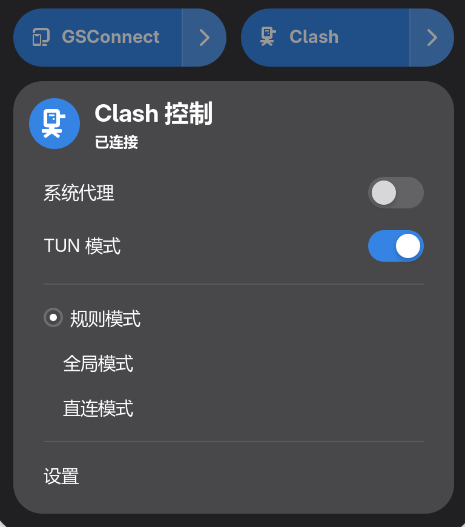

# GNOME Clash Control

Control Clash/Mihomo proxy directly from GNOME Quick Settings.




**English** | [中文](#中文)

## Features

- Toggle system proxy on/off
- Switch proxy mode (Rule / Global / Direct)
- TUN mode toggle

## Requirements

- GNOME Shell 49 / 50
- Clash or Mihomo with RESTful API enabled

## Installation from source

```bash
git clone https://github.com/n8sPxD/gnome-shell-extension-clash-control.git
cd gnome-shell-extension-clash-control
make build
make install
```

- Restart the shell
- Enable the extension

## Configuration

Open extension preferences to set:

| Setting | Default | Description |
|---------|---------|-------------|
| API Host | `127.0.0.1` | Clash API address |
| API Port | `9090` | Clash API port |
| API Secret | *(empty)* | Clash API authentication secret |
| HTTP/HTTPS Port | `7890` | HTTP proxy port |
| SOCKS5 Port | `7891` | SOCKS5 proxy port |

## License

[GPL-3.0](./LICENSE)

---

<a id="中文"></a>

## 中文

在 GNOME 快速设置面板中直接控制 Clash/Mihomo 代理。

## 功能

- 开关系统代理
- 切换代理模式（规则 / 全局 / 直连）
- TUN 模式开关

## 环境要求

- GNOME Shell 49 / 50
- Clash 或 Mihomo，需开启 RESTful API

## 从源码安装

```bash
git clone https://github.com/n8sPxD/gnome-shell-extension-clash-control.git
cd gnome-shell-extension-clash-control
make build
make install
```

- 重启 Shell
- 启用扩展

## 配置

在扩展设置中配置：

| 设置项 | 默认值 | 说明 |
|--------|--------|------|
| API 地址 | `127.0.0.1` | Clash API 地址 |
| API 端口 | `9090` | Clash API 端口 |
| API 密钥 | *(空)* | Clash API 认证密钥 |
| HTTP/HTTPS 端口 | `7890` | HTTP 代理端口 |
| SOCKS5 端口 | `7891` | SOCKS5 代理端口 |

## 许可证

[GPL-3.0](./LICENSE)
